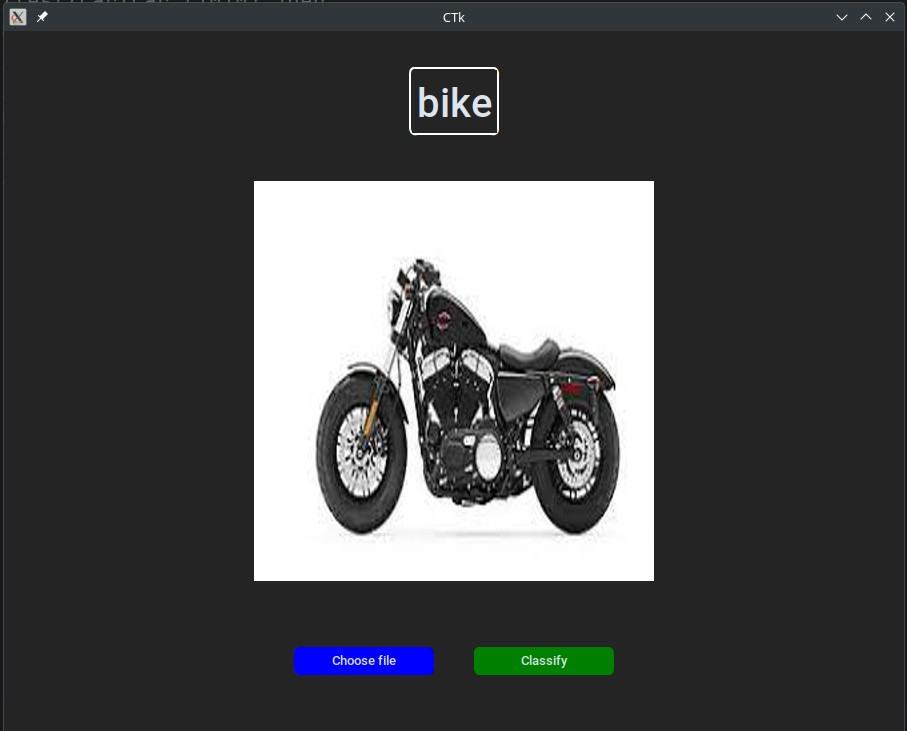

# Simple Car vs Bike classifier

This is a simple Car Vs Bike image classifier using pytorch.


# Usage

## Organize training,evaluation and test data
Dataset:
[Car Vs Bike  Dataset](https://www.kaggle.com/datasets/utkarshsaxenadn/car-vs-bike-classification-dataset)

    - Create "data" directory
    - Create train, evaluation and test directories
    - Inside each of 3 directories, create 2 directories named "Bike" and "Car"
    - Split all of Car and Bike images into 3 directories collected from the dataset(only the jpeg images)

## Install the necessary python packages:

```bash
pip install torch torchvision customtkinter
```

## Run main.py and train the model:
### Change directory to src/

```python
python main.py
```
It'll take some time to complete the training.

## Run the UI and classify images
### Change directory to src/
```bash
cd src/
```
### Run the UI
```python
python ui.py
```
Select the file:
Click -> choose file 

See output:
Click -> classify



